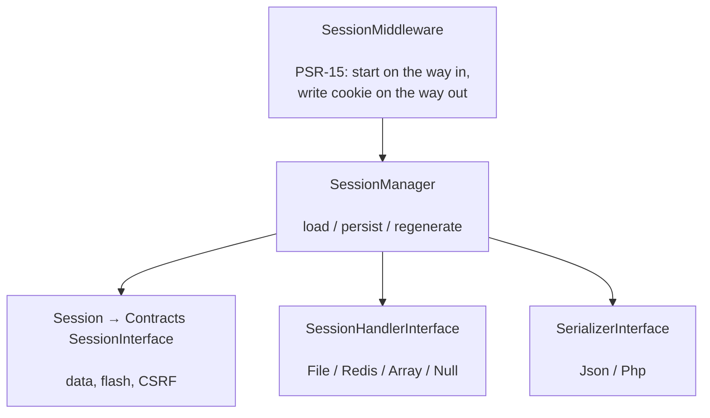

# phpdot/session

Secure session management for PSR-15 applications: pluggable storage handlers (file, Redis, array,
null), one-request flash data, CSRF tokens, and a middleware that starts the session and writes the
cookie around each request. The session implements `PHPdot\Contracts\Session\SessionInterface`, so
consumers depend on the contract, not the implementation.

## Table of Contents

- [Requirements](#requirements)
- [Installation](#installation)
- [Usage](#usage)
- [Architecture](#architecture)
- [Testing](#testing)
- [License](#license)

## Requirements

| Requirement | Constraint |
|---|---|
| PHP | `>= 8.5` |
| `phpdot/contracts` | `^0.1` |
| `psr/http-message` | `^2.0` |
| `psr/http-server-handler` | `^1.0` |
| `psr/http-server-middleware` | `^1.0` |

`ext-redis` is suggested (only for the Redis handler); `phpdot/container` is a dev-only suggestion for
the binding attributes.

## Installation

```bash
composer require phpdot/session
```

## Usage

Three objects and one middleware:

```php
use PHPdot\Session\Handler\FileHandler;
use PHPdot\Session\Middleware\SessionMiddleware;
use PHPdot\Session\SessionConfig;
use PHPdot\Session\SessionManager;

$config  = new SessionConfig(name: 'sid', lifetime: 3600);
$handler = new FileHandler('/tmp/sessions');
$manager = new SessionManager($handler, $config);

// Register SessionMiddleware as global middleware in your PSR-15 pipeline.
```

### Data and flash

```php
$session->set('user_id', 42);
$session->get('user_id');            // 42
$session->get('missing', 'default'); // 'default'
$session->all();

// Flash data lives for exactly one more request:
$session->flash('success', 'Profile updated!');
$session->getFlash('success');       // next request only
$session->keep(['success']);         // extend specific keys
```

### CSRF and lifecycle

The session issues and verifies CSRF tokens, and supports `invalidate()` (new id, keep data),
`destroy()`, and lifetime expiry — all driven through `SessionManager`.

### Handlers

`FileHandler` (filesystem), `RedisHandler` (ext-redis, TTL-based expiry), `ArrayHandler` (in-memory, for
tests), and `NullHandler` all implement `PHPdot\Contracts\Session\SessionHandlerInterface`; `JsonSerializer`
and `PhpSerializer` handle payload encoding. Any of them is a drop-in.

## Architecture

`SessionMiddleware` resolves the session for the request through `SessionManager`, which loads and saves
the payload via the configured handler and serializer. On the way out it writes the session cookie
(honouring the `SessionConfig` flags). Flash data and CSRF live in the `Session` value itself.



## Testing

```bash
composer install
composer test        # PHPUnit
composer analyse     # PHPStan, level max + strict rules
composer cs-check    # PHP-CS-Fixer
composer check       # All three
```

## License

MIT.

**This repository is a read-only mirror**, generated by CI from
[phpdot/monorepo](https://github.com/phpdot/monorepo). [Pull requests](https://github.com/phpdot/monorepo/pulls)
and [issues](https://github.com/phpdot/monorepo/issues) belong in the monorepo.
